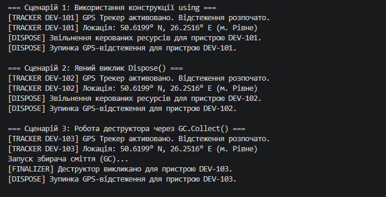

Лабораторна робота No3
• Тема: Життєвий цикл об’єкта та керування ресурсами.
Мета
Поглибити розуміння життєвого циклу об’єкта в C#, навчитися працювати з некерованими
ресурсами, реалізувати інтерфейс IDisposable та патерн Dispose.

Під час виконання лабораторної роботи було досліджено життєвий цикл об'єктів у C# та реалізовано патерн `Dispose` для керування ресурсами.
1. **Конструкція `using`:** Гарантує автоматичний і детермінований виклик `Dispose()` одразу при виході з блоку видимості, навіть якщо виникла помилка.
2. **Явний виклик `Dispose()`:** Дозволяє гнучко контролювати момент очищення ресурсів вручну, проте вимагає від розробника уважності.
3. **Робота деструктора (`~GPSTracker`) та `GC.Collect()`:** Фіналізатор виступає в ролі страховочного механізму. Якщо розробник не викликав `Dispose()`, Garbage Collector самостійно звільнить некеровані ресурси під час збірки сміття.
4. **Оптимізація пам'яті:** Виклик `GC.SuppressFinalize(this)` у методі `Dispose()` видаляє об'єкт із черги фіналізації, що запобігає повторному очищенню та прискорює робочий цикл програми.