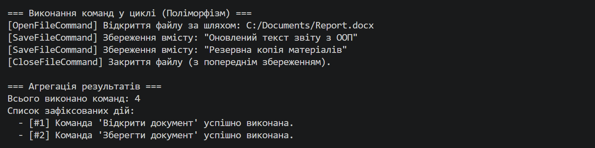

Лабораторна робота No5
Тема: Поліморфізм: динамічне зв’язування та перевизначення методів./
Мета: Навчитися реалізовувати поліморфну поведінку за допомогою віртуальних методів та їх
перевизначення, а також агрегувати результати поліморфних викликів.
Хід роботи : Реалізація ієрархії поліморфних команд:
Базовий клас Command з властивістю Name та віртуальним методом virtual void Execute().
Похідний клас OpenFileCommand із властивістю FilePath та перевизначеним override void Execute().
Похідний клас SaveFileCommand із властивістю Content та перевизначеним override void Execute().
Похідний клас CloseFileCommand із властивістю ConfirmSave та перевизначеним override void Execute().

